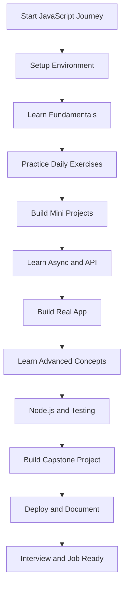
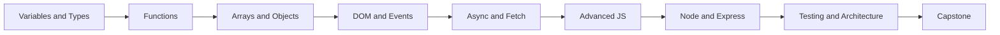
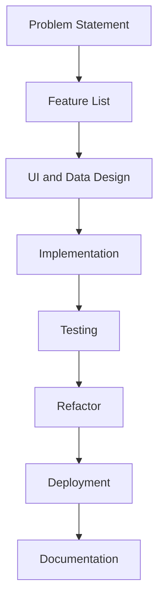
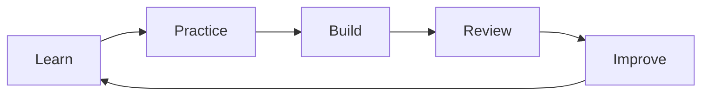

# JavaScript Learning Process Flow Diagram

## Learning Flow

```mermaid
flowchart TD
  A[Start JavaScript Journey] --> B[Setup Environment]
  B --> C[Learn Fundamentals]
  C --> D[Practice Daily Exercises]
  D --> E[Build Mini Projects]
  E --> F[Learn Async and API]
  F --> G[Build Real App]
  G --> H[Learn Advanced Concepts]
  H --> I[Node.js and Testing]
  I --> J[Build Capstone Project]
  J --> K[Deploy and Document]
  K --> L[Interview and Job Ready]
```

## Topic Dependency Flow

```mermaid
flowchart LR
  A[Variables and Types] --> B[Functions]
  B --> C[Arrays and Objects]
  C --> D[DOM and Events]
  D --> E[Async and Fetch]
  E --> F[Advanced JS]
  F --> G[Node and Express]
  G --> H[Testing and Architecture]
  H --> I[Capstone]
```

## Project Execution Flow

```mermaid
flowchart TD
  P1[Problem Statement] --> P2[Feature List]
  P2 --> P3[UI and Data Design]
  P3 --> P4[Implementation]
  P4 --> P5[Testing]
  P5 --> P6[Refactor]
  P6 --> P7[Deployment]
  P7 --> P8[Documentation]
```

## Study Sprint Loop

```mermaid
flowchart LR
  S1[Learn] --> S2[Practice]
  S2 --> S3[Build]
  S3 --> S4[Review]
  S4 --> S5[Improve]
  S5 --> S1
```
